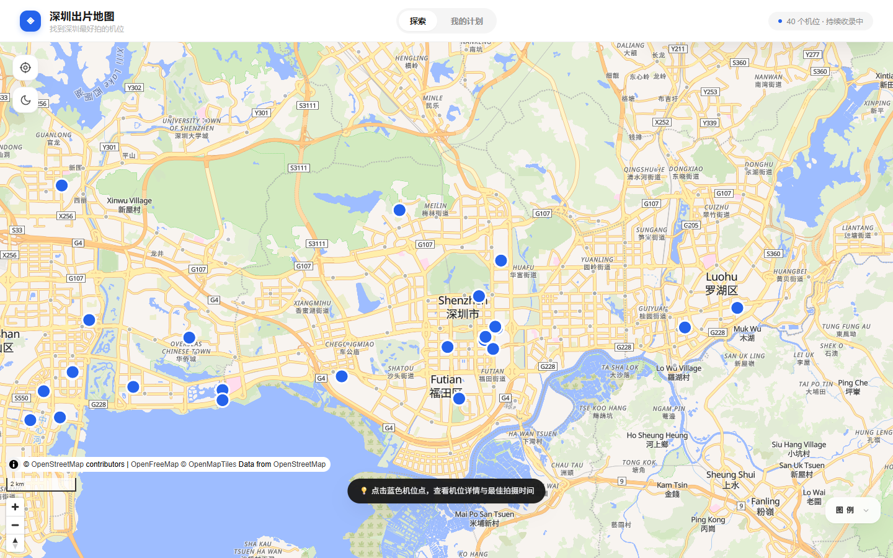
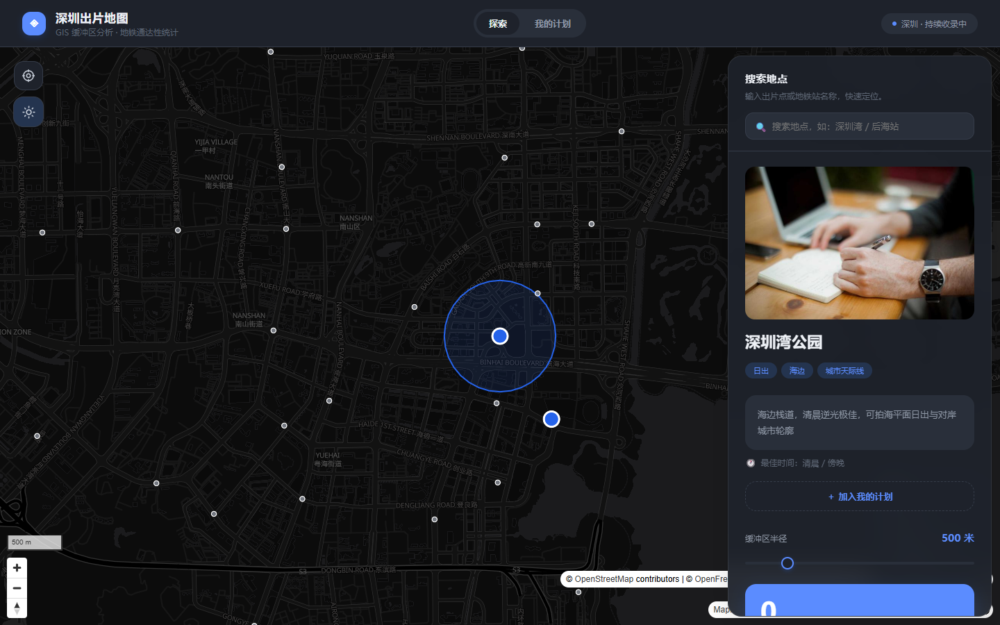
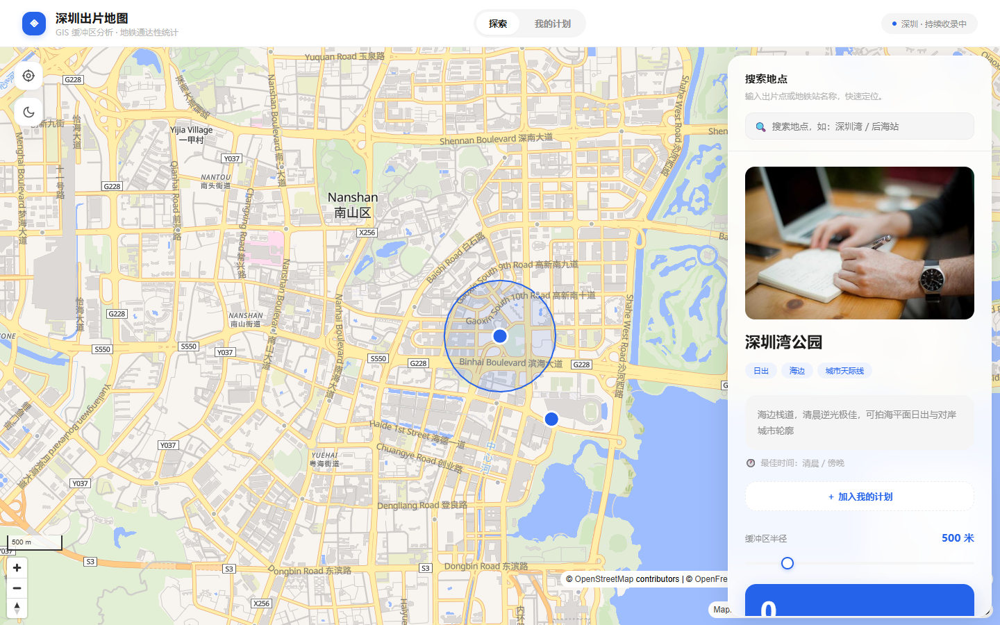

# 深圳出片地图

一个面向摄影爱好者的深圳拍照机位地图：发现出片点、用 GIS 缓冲区分析评估地铁通达性、规划拍摄路线。纯前端实现，无需后端，可直接部署到 GitHub Pages。

## 为什么做

摄影爱好者找一个好机位，往往要在小红书、地图、笔记之间来回切换：机位散在帖子里，交通方不方便要另查，拍之前还得自己串路线。

这个项目想把这些收进一张地图里：

- **机位一张图看全**：出片点直接标在地图上，带示例图、标签、最佳拍摄时间；
- **通达性算给你看**：点击出片点自动做 GIS 缓冲区分析，统计半径内地铁站数量，"好不好到"一目了然；
- **路线不用手搓**：收藏进"我的计划"后自动按最近邻串成拍摄路线，导航交给高德（URI 深链唤起），专业的事交给专业的工具。

## 功能亮点

- 地图展示：全屏沉浸式布局，OpenFreeMap 矢量底图（免费、无需 key）
- 出片点标注：出片点醒目、地铁站淡雅，主次分明；点击地铁站查看线路信息
- 缓冲区分析：点击出片点自动绘制缓冲区（turf.js），统计范围内地铁站数量，滑块实时调整半径（200–2000m）
- 详情面板：示例图（加载失败有兜底占位）、标签、点评、最佳拍摄时间
- 搜索：按名称 / 标签 / 线路号搜索出片点和地铁站
- 用户定位：LBS 获取当前位置并标注，作为路线规划起点
- 我的计划：收藏 / 移除 / 清空出片点，localStorage 本地持久化
- 计划网络：贪心最近邻算法把计划点串成路线，点状虚线展示
- 路线规划：URI 深链跳转高德地图导航（起点 / 途经点 / 终点）
- 主题切换：深色 / 浅色双主题（深色参考高德配色），圆扩散过渡动画
- 移动端适配：面板在小屏上变为底部抽屉

## 效果展示

| 浅色模式 | 深色模式 | 缓冲区分析 |
|---|---|---|
|  |  |  |

## 快速使用

纯静态页面，但需要本地起一个 HTTP 服务（直接双击 `index.html` 走 `file://` 会被浏览器 CORS 拦截，读不到 JSON 数据）：

```bash
# 任选其一
python -m http.server 8000
npx serve .
```

然后浏览器打开 `http://localhost:8000`。

部署：直接把本目录推到 GitHub 仓库，开启 GitHub Pages 即可（纯静态，零构建）。

## 怎么加一个出片点

打开 `spots.json`，照着已有格式加一条：

```json
{
  "name": "点位的名字",
  "lng": 114.0000,
  "lat": 22.5000,
  "tags": ["夜景", "海边"],
  "note": "一句点评",
  "best_time": "夜晚",
  "image": "示例图 URL，或留空"
}
```

坐标（WGS-84）可从高德 / 百度「坐标拾取器」或 OSM 右键获取。

## 数据来源与第三方署名

本项目代码使用 MIT License 开源，但项目中展示或访问的第三方数据不属于本项目：

- **地铁站数据**（`metro.json`）：来自 [OpenStreetMap](https://www.openstreetmap.org/)（通过 Overpass API 查询，含线路号），© OpenStreetMap contributors，遵循 [ODbL 协议](https://opendatacommons.org/licenses/odbl/)。
- **地图底图**：来自 [OpenFreeMap](https://openfreemap.org/)（基于 OpenStreetMap 数据），使用时应保留相应署名。
- **出片点数据**（`spots.json`）：作者自维护；机位详情图来自 [Wikimedia Commons](https://commons.wikimedia.org/)（每张图已在详情页标注作者与许可证，为场景示意、非机位实拍），正逐步替换为作者实地拍摄作品（首张：人才公园）。
- 导航能力由高德地图 URI API 提供，路线计算不在本项目内进行。

## 技术栈（全部免费）

- 地图：MapLibre GL JS + OpenFreeMap
- GIS 分析：turf.js（缓冲区 + 点面统计）
- 数据：JSON 文件（无需后端数据库）
- 托管：GitHub Pages / Vercel 均可

## 路线图

- [ ] 点位扩充：从 8 个示例点扩充至 30–50 个深圳实地机位，替换为真实拍摄作品
- [ ] AI 一句话筛选：输入"离地铁近、适合日落的点"，大模型翻译成筛选条件自动标点
- [ ] AI 点评生成：根据点位特征自动生成推荐文案
- [ ] 计划分享：导出 / 导入拍摄计划

## 开源协议

本项目代码基于 [MIT License](LICENSE) 开源。
